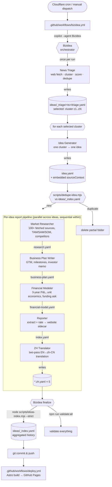

# Bizidea

Bizidea is a daily, fully-automated startup-research factory. A Cloudflare Cron Worker dispatches a GitHub Actions workflow that invokes the **Bizidea** Copilot orchestrator: one **News Triage** scan, idea generation + dedupe, then per-idea report production. Each surviving topic becomes a folder of YAML artifacts (idea, market research, business plan, 3-year financial model, machine-readable index) plus Simplified Chinese siblings. The companion Astro site renders those YAMLs as an FT-style editorial reading experience and ships to GitHub Pages on every push.

Live site: <https://bizidea.genisisiq.com>

## How it works

A run is one orchestrator (`Bizidea`) delegating to seven specialists. Each specialist owns exactly one artifact, validates it against a minimum-fields gate, then hands off. The orchestrator never writes stage YAML itself.

### End-to-end flow



### Agents

| # | Agent | Writes | Job |
|---|---|---|---|
| 1 | **News Triage** | `_triage/<ts>/triage.yaml` | One scan per run. Fetches ~120 URLs, keeps ~80, clusters them, scores 4 sub-axes, dedupes against `_index.yaml`, marks top `cap` `new` clusters as `selected`. |
| 2 | **Idea Generator** | `<folder>/idea.yaml` | One cluster → one venture-scale idea: wedge, beachhead, GTM seed, source-grounded "why now". Embeds `sourceContext`; no web access. |
| 2.5 | _gate_ | (deletes folder on dup) | `scripts/dedupe-idea.mjs` runs after every `idea.yaml`. Duplicates removed before any research starts. |
| 3 | **Market Researcher** | `<folder>/research.yaml` | Auditable evidence corpus (100+ deduped fetched sources), bottom-up TAM/SAM/SOM, ≤5 competitors, regulation, customer signals, `openQuestions`. |
| 4 | **Business Plan Writer** | `<folder>/business-plan.yaml` | Investor-ready plan: ICP, product sequencing, GTM, milestones, hiring, risks, funding ask, investor memo. No web; gaps surfaced as `null`. |
| 5 | **Financial Modeler** | `<folder>/financial-model.yaml` | 3-year model: monthly Y1 + quarterly Y2/Y3 P&L, headcount, CAC/LTV/payback, runway-based funding ask, `sanityChecks.flags`, `modelSanity` summary. Every number ties to `assumptions[]`. |
| 6 | **Reporter** | `<folder>/index.yaml` | Extracts and rates (does not reinterpret) into the compact website sidecar. Preserves units (`K`, `M`); missing values → `null`. |
| 7 | **ZH Translator** | `<folder>/*.zh.yaml` (×5) | Two-pass EN→zh-CN (draft + reflection/revision). Schema-preserving; never modifies English sources. |
| ∞ | **Bizidea** finalize | `ideas/_index.yaml` | After all five `*.zh.yaml` exist, sweeps partial `<runTimestamp>-*` folders, rebuilds the history index with `--strict`, then runs `npm run validate:all` (the same superset CI uses). |

### Orchestration rules

- **One triage per run.** No second scout/news agent.
- **Generate-then-research barrier.** All selected ideas are generated and deduped *before* any `Market Researcher` invocation, so the dedupe gate is authoritative across the batch.
- **Parallel across ideas, sequential within.** Stages inside a pipeline wait for the previous file to exist, parse, and pass the minimum-fields gate.
- **Gate-and-retry.** A failed gate triggers exactly one retry of the same specialist. A second failure marks only that idea as failed and deletes its partial folder.
- **Stable folder names.** [scripts/report-dir.mjs](scripts/report-dir.mjs) creates `ideas/<runTimestamp>-<slug>/` once; the name never changes if the slug evolves.
- **Hard stops.** Triage failure or final index-rebuild failure aborts the whole run; per-idea failures only abort that idea.
- **Localization is part of "done".** A report is not generated until its five `*.zh.yaml` files exist and parse.

### Artifact gates

The minimum-fields contract for each stage YAML lives in [.github/agents/bizidea.agent.md](.github/agents/bizidea.agent.md#artifact-gates) and is enforced deterministically by [scripts/validate-stage.mjs](scripts/validate-stage.mjs). Each specialist runs the validator before handoff; the orchestrator may re-run it during gate-and-retry.

## Repository layout

| Path | Purpose |
|---|---|
| `ideas/` | Report folders (English + `*.zh.yaml`). `_index.yaml` = aggregated history. `_triage/<ts>/` = daily triage. `_`-prefixed paths ignored by Astro. |
| `website/` | [Astro 5](https://astro.build) site that renders reports. |
| `cloudflare/` | Cloudflare Worker scheduler. |
| `.github/agents/` | Copilot agents: `Bizidea` orchestrator, the seven specialists above, and shared references (`handoff-protocol.md`, `sector-vocabulary.md`, `yaml-syntax.md`). |
| `.github/workflows/` | `bizidea.yml` (Cloudflare-dispatched run) and `deploy.yml` (publishes the site on `main` pushes touching `website/**` or `ideas/**`). |
| `scripts/` | Deterministic Node helpers: `ideas-index.mjs`, `dedupe-idea.mjs`, `report-dir.mjs`, `validate-stage.mjs`, `check-agent-frontmatter.mjs`, `check-zh-translation.mjs`, `check-near-duplicates.mjs`, `validate-all.mjs`, shared `text.mjs`. |
| [AGENTS.md](AGENTS.md) | Coding-agent quick reference (commands, layout, YAML conventions). |

YAML conventions (camelCase field names, units in numeric names like `revenueK`/`marginPct`, indentation/quoting/multi-line rules) live in [.github/agents/yaml-syntax.md](.github/agents/yaml-syntax.md).

## Local development

```bash
cd website
npm ci
npm run dev          # http://localhost:4321/
npm run build        # static output → website/dist/ (runs check-ideas first)
```

The website build is read-only with respect to `ideas/`. YAML repair (`npm --prefix website run repair:yaml`) runs in the daily workflow before commits, not during rendering.

Common checks from the repo root:

| Command | Purpose |
|---|---|
| `npm run build:ideas-index` | Rebuild `ideas/_index.yaml` from completed folders. |
| `npm run check:ideas-index` | Validate `_index.yaml` without rewriting. |
| `npm run validate:all` | Full local validation gate. |
| `npm run check:duplicates` | Flag likely near-duplicate report pairs (non-blocking). |
| `npm run check:test` | Vitest. |

## Running the pipeline

In CI, the Cloudflare scheduler dispatches the workflow daily. Manual triggers:

- **GitHub UI**: Actions → *Bizidea — triage, generate, and publish reports* → *Run workflow*. Inputs: `cap` (1–5), `timeWindow` (e.g. `yesterday`, `last 7 days`), `model` (default `gpt-5.4` → effect `xhigh`; `gpt-5.5` → effect `xhigh`; `claude-opus-4.6` and `claude-sonnet-4.6` → effect `high`).
- **Local Copilot CLI** (requires a Copilot license):

  ```bash
  npm install -g @github/copilot
  copilot --yolo --autopilot --model gpt-5.4 --effort xhigh --agent Bizidea \
    -p "Scan yesterday's startup news and generate up to 5 non-duplicate startup reports."
  ```

## Deployment

[`deploy.yml`](.github/workflows/deploy.yml) builds the Astro site and publishes to GitHub Pages on `main` pushes touching `website/**`, `ideas/**`, or the workflow itself. The custom domain `bizidea.genisisiq.com` is set via [website/public/CNAME](website/public/CNAME).

### Cloudflare scheduler

[cloudflare/worker.js](cloudflare/worker.js) dispatches [.github/workflows/bizidea.yml](.github/workflows/bizidea.yml) once per day at `07:00 UTC` via `workflow_dispatch`. The native GitHub Actions cron is commented out to prevent duplicate runs.

Deploy from [cloudflare/](cloudflare/):

```bash
npx wrangler secret put GITHUB_TOKEN   # fine-grained PAT, Actions: Read & write
npx wrangler secret put GITHUB_REPO    # vibewatch/bizidea
npx wrangler deploy
```

Optional vars in [cloudflare/wrangler.toml](cloudflare/wrangler.toml) override dispatch defaults: `BIZIDEA_CAP` (1–5, default `5`), `BIZIDEA_TIME_WINDOW` (default `yesterday`), `BIZIDEA_MODEL` (default `gpt-5.4`; also `gpt-5.5` / `claude-opus-4.6` / `claude-sonnet-4.6` — effect derived automatically).

## Required secrets

| Secret | Used by | Purpose |
|---|---|---|
| `COPILOT_PAT` | `bizidea.yml` | Copilot-licensed PAT, passed as `COPILOT_GITHUB_TOKEN` to the Copilot CLI. |
| `BIZIDEA_PAT` | `bizidea.yml` | Repo-write PAT used for checkout and the daily commit, so downstream deploy workflows trigger reliably. |

## License

MIT.