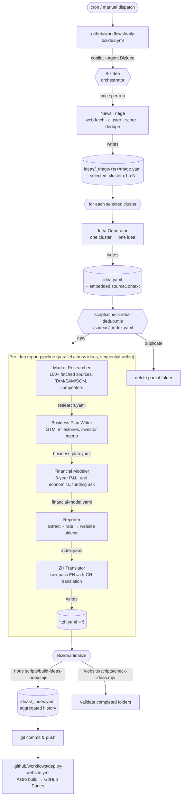

# Bizidea

Bizidea is a daily, fully-automated startup-research factory. A scheduled GitHub Actions workflow invokes the **Bizidea** Copilot orchestrator, which runs one **News Triage** scan, generates and dedupes ideas from selected clusters, then starts report production for each surviving idea. Each successful topic becomes a self-contained folder of YAML artifacts spanning idea synthesis, embedded source context, market research, business plan, 3-year financial model, and a machine-readable index. The companion Astro site renders those YAMLs as an FT-style editorial reading experience and ships to GitHub Pages on every push.

Live site: <https://bizidea.genisisiq.com>

## How it works

A Bizidea run is one orchestrator (`Bizidea`) delegating to seven specialist agents. Each specialist owns exactly one artifact, validates it against a minimum-fields gate, and only then hands off to the next stage. The orchestrator never writes stage YAML itself.

### End-to-end flow



### Agent responsibilities

| Stage | Agent | Reads | Writes | Key job |
|---|---|---|---|---|
| 0 | **Bizidea** | user prompt, repo state | nothing directly | Resolve `topic` / `cap` / `timeWindow` / `runTimestamp`; sequence specialists; enforce gates; never invokes itself; never writes stage YAML. |
| 1 | **News Triage** | web (broad fetch), `ideas/_index.yaml` | `ideas/_triage/<ts>/triage.yaml` | One scan per run. Fetches ~120 candidate URLs, keeps ~80 verified items, groups them into opportunity clusters, scores 4 sub-scores, dedupes against history (`eventKeys`, `slugs`, canonical URLs, keyword overlap), and marks the top `cap` `new` clusters as `selected`. |
| 2 | **Idea Generator** | `triage.yaml` (one cluster), `_index.yaml` | `<folder>/idea.yaml` | One cluster &rarr; one venture-scale idea with sharp wedge, beachhead customer, GTM seed, and source-grounded "why now". Embeds `sourceContext`; never searches the web. |
| 2.5 | _gate_ | `idea.yaml`, `_index.yaml` | (deletes folder on duplicate) | `scripts/check-idea-dedup.mjs` runs after every `idea.yaml`. Duplicates are removed before any research starts. |
| 3 | **Market Researcher** | `idea.yaml`, web | `<folder>/research.yaml` | Builds an auditable evidence corpus (target 100+ deduped fetched sources), bottom-up TAM/SAM/SOM, ≤5 competitors with wedge analysis, regulation, customer signals, and `openQuestions` for honest gaps. |
| 4 | **Business Plan Writer** | `idea.yaml`, `research.yaml` | `<folder>/business-plan.yaml` | Investor-ready plan: ICP, product sequencing, GTM system, milestones, hiring plan, risks, funding ask, investor memo. No web access; gaps surfaced as `null`. |
| 5 | **Financial Modeler** | `business-plan.yaml`, `research.yaml` | `<folder>/financial-model.yaml` | 3-year model: monthly Y1 + quarterly Y2/Y3 P&L, headcount plan, unit economics (CAC/LTV/payback), runway-based funding ask, `sanityChecks.flags`, and an investor-facing `modelSanity` summary. Every number traces to an `assumptions[]` entry. |
| 6 | **Reporter** | all four stage YAMLs | `<folder>/index.yaml` | Extracts and rates (does not reinterpret) the stage artifacts into the compact website sidecar. Preserves units (`K`, `M`); missing values become `null`. |
| 7 | **ZH Translator** | five English YAMLs in folder | `<folder>/*.zh.yaml` (×5) | Two-pass EN&rarr;zh-CN translation (draft + reflection/revision) producing schema-preserving Chinese siblings. Never modifies English sources. |
| ∞ | **Bizidea** (finalize) | completed folders | `ideas/_index.yaml` | After every report has all five `*.zh.yaml` files, rebuilds the history index via `scripts/build-ideas-index.mjs`, runs `website/scripts/check-ideas.mjs`, and emits the run summary. |

### Orchestration rules

- **One triage per run.** `News Triage` is invoked exactly once; the orchestrator never spins up a second scout/news agent.
- **Generate-then-research barrier.** All selected ideas are generated and deduped *before* any `Market Researcher` invocation. This keeps the dedupe gate authoritative across the whole batch.
- **Parallel across ideas, sequential within.** Per-idea pipelines (`research → business-plan → financial-model → report → zh`) may run concurrently, but each stage inside a pipeline waits for the previous file to exist, parse as YAML, and pass a minimum-fields gate.
- **Gate-and-retry.** A failed gate triggers exactly one retry of the same specialist with the validation error and the same folder path. A second failure marks only that idea as failed; its partial folder is deleted so the website's content-collection check does not see incomplete reports.
- **Stable folder names.** [scripts/prepare-report-folder.mjs](scripts/prepare-report-folder.mjs) creates `ideas/<runTimestamp>-<slug>/` once; the folder name never changes if the idea slug evolves later.
- **Hard stops.** Triage failure, missing repository paths, or final index-rebuild failure aborts the entire run. Per-idea failures only abort that idea.
- **Localization is part of "done".** A report is not considered generated until its five `*.zh.yaml` files exist and parse — only then does finalization rebuild `_index.yaml`.

### Artifact gates

The orchestrator validates each handoff against the minimum-field schema below before advancing:

| File | Minimum fields |
|---|---|
| `triage.yaml` | `runDate`, `timeWindow`, `clustersFound`, `selectedCount`, `clusters` |
| `idea.yaml` | `slug`, `date`, `pitch`, `sourceContext`, `startupThesis`, `goToMarketSeed`, `solution` |
| `research.yaml` | `slug`, `date`, `market`, `competitors`, `researchCoverage`, `deduplication`, `evidenceCorpus`, `sources`, `reportMemo.incumbentThesis` |
| `business-plan.yaml` | `slug`, `date`, `executiveSummary`, `strategicChoices`, `market`, `product`, `gtm`, `milestones`, `fundingAsk`, `investorMemo`, `operatingAssumptions` |
| `financial-model.yaml` | `slug`, `date`, `totals`, `unitEconomics`, `fundingAsk`, `modelSanity` |
| `index.yaml` | `slug`, `date`, `pitch`, `rating`, `files`, `financials` |
| `*.zh.yaml` | All five Chinese siblings exist, are non-empty, parse as YAML, and preserve the English schema shape |

## Repository layout

| Path | Purpose |
|---|---|
| `ideas/` | Generated report artifacts. Each dated folder is one startup package containing five English YAMLs and their `*.zh.yaml` Simplified Chinese counterparts. `_index.yaml` is the aggregated history (rebuilt by [scripts/build-ideas-index.mjs](scripts/build-ideas-index.mjs)). `_triage/<runTimestamp>/triage.yaml` records each daily triage. Underscore-prefixed paths are ignored by the Astro content collection. |
| `website/` | [Astro 5](https://astro.build) site that renders reports as editorial pages. |
| `.github/agents/` | Custom Copilot agent definitions: `Bizidea` (the orchestrator) plus `News Triage`, `Idea Generator`, `Market Researcher`, `Business Plan Writer`, `Financial Modeler`, `Reporter`, `ZH Translator`, and the `yaml-syntax` reference. |
| `.github/workflows/` | `daily-bizidea.yml` (scheduled multi-report run) and `deploy-website.yml` (publishes the site on `main` pushes touching `website/**` or `ideas/**`). |
| `scripts/` | Repo-level deterministic helpers: `build-ideas-index.mjs`, `check-idea-dedup.mjs`, `prepare-report-folder.mjs`, and the shared `text-utils.mjs` tokenizer. |
| [AGENTS.md](AGENTS.md) | Unified coding-agent instructions (working approach, repo map, YAML conventions). |

## YAML schema conventions

All pipeline artifacts are YAML files (`idea.yaml`, `research.yaml`, `business-plan.yaml`, `financial-model.yaml`, `index.yaml`, their `*.zh.yaml` Simplified Chinese counterparts, plus per-run `_triage/<ts>/triage.yaml` and the aggregated `_index.yaml`).

- Prefer descriptive **camelCase** field names.
- Include units in numeric field names where helpful: `fundingRangeUsd`, `revenueK`, `marginPct`, `headcountEop`.
- Follow [.github/agents/yaml-syntax.md](.github/agents/yaml-syntax.md) for indentation, quoting, block-vs-flow style, and multi-line strings.

## Local development

### Website

```bash
cd website
npm ci
npm run dev      # http://localhost:4321/
npm run build    # static output → website/dist/
```

The website build is intentionally read-only with respect to `ideas/`: it runs `check-ideas` before `astro build`. YAML repair scripts are available through `npm --prefix website run repair:yaml`, but the daily generation workflow runs them before committing artifacts rather than during website rendering.

### Rebuild the dedupe index

```bash
npm run build:ideas-index
```

To validate without rewriting `ideas/_index.yaml`:

```bash
npm run check:ideas-index
```

To run the full local validation gate:

```bash
npm run validate
```

### Helper scripts

The `Bizidea` agent owns orchestration, but uses small deterministic scripts for repeatable file-system work:

| Script | Purpose |
|---|---|
| `scripts/build-ideas-index.mjs` | Rebuilds `ideas/_index.yaml` from completed report folders. |
| `scripts/check-idea-dedup.mjs` | Compares a newly generated `idea.yaml` against `_index.yaml` and can delete duplicate partial folders. |
| `scripts/prepare-report-folder.mjs` | Creates a stable `ideas/<runTimestamp>-<slug>/` folder for one selected idea. |
| `scripts/text-utils.mjs` | Shared tokenizer/stopword helpers used by the dedupe and index scripts. |

## Running the pipeline

The agent-orchestrated pipeline runs in CI on a daily schedule, but you can also trigger it manually:

- **Manually via GitHub UI**: Actions → *Daily Bizidea run* → *Run workflow* (inputs: `cap`, `timeWindow`).
- **Locally via Copilot CLI** (requires a Copilot license; the `Bizidea` agent orchestrates all stages):

  ```bash
  npm install -g @github/copilot
  copilot --yolo --agent Bizidea -p "Scan yesterday's startup news and generate up to 5 non-duplicate startup reports."
  ```

The important sequencing rule is: `News Triage` runs once, `Idea Generator` creates and dedupes ideas from that triage output, and only then does `Bizidea` start parallel per-idea report pipelines (`research → business plan → financial model → report → zh translation`).

## Deployment

`deploy-website.yml` builds the Astro site and publishes to GitHub Pages whenever `main` receives a push touching `website/**`, `ideas/**`, or the workflow itself. The custom domain `bizidea.genisisiq.com` is set via [website/public/CNAME](website/public/CNAME).

## Required secrets

| Secret | Used by | Purpose |
|---|---|---|
| `COPILOT_PAT` | `daily-bizidea.yml` | PAT for a Copilot-licensed account; passed as `COPILOT_GITHUB_TOKEN` to the Copilot CLI. |
| `BIZIDEA_PAT` | `daily-bizidea.yml` | PAT with repo write access for checkout/push so the resulting commit can trigger downstream deploy workflows. |

The workflow uses `contents: write`, but `BIZIDEA_PAT` is used for checkout and pushing the daily commit so downstream workflows such as Pages deploy can be triggered reliably.

## License

MIT.
