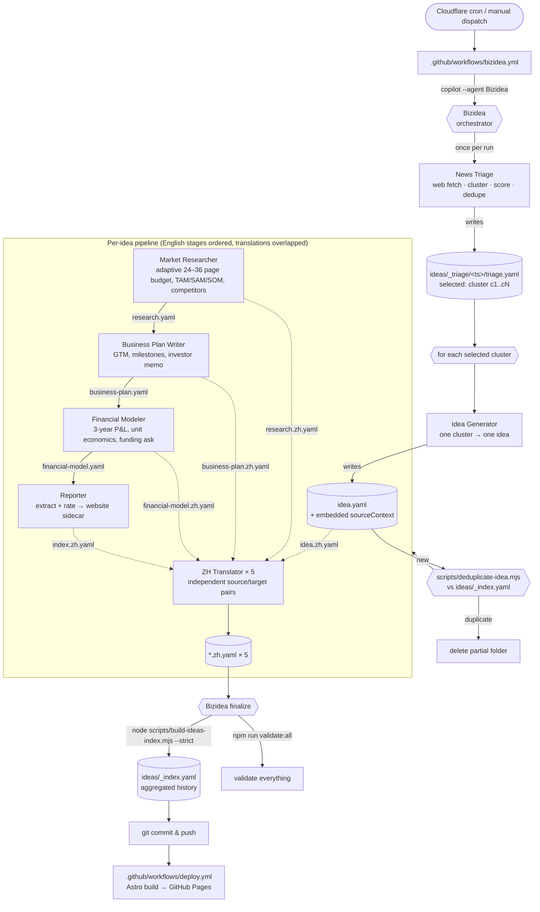

# Bizidea

Bizidea is a daily, fully-automated startup-research factory. A Cloudflare Cron Worker dispatches a GitHub Actions workflow that invokes the **Bizidea** Copilot orchestrator: one **News Triage** scan, idea generation + dedupe, then per-idea report production. Each surviving topic becomes a folder of YAML artifacts (idea, market research, business plan, 3-year financial model, machine-readable index) plus Simplified Chinese siblings. The companion Astro site renders those YAMLs as an FT-style editorial reading experience and ships to GitHub Pages on every push.

Live site: <https://bizidea.genisisiq.com>

## How it works

A run is one orchestrator (`Bizidea`) delegating to seven specialists through GitHub Copilot's native custom-agent mechanism. Each specialist owns exactly one artifact and validates it; the orchestrator verifies files and validator exit codes instead of parsing a home-grown response protocol.

### End-to-end flow


```mermaid
flowchart TD
  cron([Cloudflare cron / manual dispatch]) --> wf[".github/workflows/bizidea.yml"]
    wf -->|"copilot --agent Bizidea"| orch{{"Bizidea<br/>orchestrator"}}

    orch -->|"once per run"| triage["News Triage<br/>web fetch · cluster · score · dedupe"]
    triage -->|"writes"| triageFile[("ideas/_triage/&lt;ts&gt;/triage.yaml<br/>selected: cluster c1..cN")]

    triageFile --> fanout{{"for each selected cluster"}}
    fanout --> idea["Idea Generator<br/>one cluster &rarr; one idea"]
    idea -->|"writes"| ideaFile[("idea.yaml<br/>+ embedded sourceContext")]
    ideaFile --> dedup{{"scripts/deduplicate-idea.mjs<br/>vs ideas/_index.yaml"}}
    dedup -->|"duplicate"| drop["delete partial folder"]
    dedup -->|"new"| pipeline

    subgraph pipeline ["Per-idea pipeline (English stages ordered, translations overlapped)"]
        direction TB
        mr["Market Researcher<br/>adaptive 24–36 page budget, TAM/SAM/SOM, competitors"] -->|"research.yaml"| bp["Business Plan Writer<br/>GTM, milestones, investor memo"]
        bp -->|"business-plan.yaml"| fm["Financial Modeler<br/>3-year P&amp;L, unit economics, funding ask"]
        fm -->|"financial-model.yaml"| rep["Reporter<br/>extract + rate &rarr; website sidecar"]
        zh["ZH Translator &times; 5<br/>independent source/target pairs"]
        ideaFile -.->|"idea.zh.yaml"| zh
        mr -.->|"research.zh.yaml"| zh
        bp -.->|"business-plan.zh.yaml"| zh
        fm -.->|"financial-model.zh.yaml"| zh
        rep -.->|"index.zh.yaml"| zh
        zh --> zhFiles[("*.zh.yaml &times; 5")]
    end

    zhFiles --> finalize{{"Bizidea finalize"}}
    finalize -->|"node scripts/build-ideas-index.mjs --strict"| indexFile[("ideas/_index.yaml<br/>aggregated history")]
    finalize -->|"npm run validate:all"| validate["validate everything"]
    indexFile --> push["git commit &amp; push"]
    push --> deploy[".github/workflows/deploy.yml<br/>Astro build &rarr; GitHub Pages"]
```

### Agents

| # | Agent | Writes | Job |
|---|---|---|---|
| 1 | **News Triage** | `_triage/<ts>/triage.yaml` | Runs parallel search lanes with AnySearch when available, otherwise native web search. Selects only non-dominated cohort champions scoring 5 in creativity, venture potential, or white space, with hard source-diversity floors. |
| 2 | **Idea Generator** | `<folder>/idea.yaml` | Privately explores ≥6 concepts across ≥4 venture archetypes, chooses a single champion rather than an average, records nearest-history differences, and rejects OS/copilot/control-plane naming. |
| 2.5 | _gate_ | (deletes folder on dup) | `scripts/deduplicate-idea.mjs` runs after every `idea.yaml`. Duplicates removed before any research starts. |
| 3 | **Market Researcher** | `<folder>/research.yaml` | Adaptive 24–36 page budget with parallel evidence lanes and saturation stopping; enforces publisher, source-type, primary, independent, and geographic diversity. |
| 4 | **Business Plan Writer** | `<folder>/business-plan.yaml` | Investor-ready plan: ICP, product sequencing, GTM, milestones, hiring, risks, funding ask, investor memo. No web; gaps surfaced as `null`. |
| 5 | **Financial Modeler** | `<folder>/financial-model.yaml` | 3-year model: monthly Y1 + quarterly Y2/Y3 P&L, headcount, CAC/LTV/payback, runway-based funding ask, `sanityChecks.flags`, `modelSanity` summary. Every number ties to `assumptions[]`. |
| 6 | **Reporter** | `<folder>/index.yaml` | Extracts and rates into the compact website sidecar and exposes the idea's champion `selectionLens`. Preserves units (`K`, `M`); missing values → `null`. |
| 7 | **ZH Translator** | One requested `<folder>/*.zh.yaml` | Five independent pair jobs overlap translation with downstream English stages; each runs schema, identifier, number, terminology, untranslated-prose, and translationese checks. |
| ∞ | **Bizidea** finalize | `ideas/_index.yaml` | After all five `*.zh.yaml` exist, sweeps partial `<runTimestamp>-*` folders, rebuilds the history index with `--strict`, then runs `npm run validate:all` (the same superset CI uses). |

### Orchestration rules

- **One triage per run.** No second scout/news agent.
- **Native delegation.** Parent/child completion is provided by GitHub Copilot. Artifact existence and deterministic validators are authoritative.
- **Champion selection.** Every selected cluster must lead the cohort in at least one exceptional dimension and sit on the Pareto frontier; weighted-average mediocrity cannot pass.
- **Generate-then-research barrier.** All selected ideas are generated and deduped *before* any `Market Researcher` invocation, so the dedupe gate is authoritative across the batch.
- **Ordered English, overlapped translation.** English stages remain dependency-ordered, while each validated artifact is translated concurrently with the next English stage.
- **Gate-and-retry.** A failed gate triggers exactly one retry of the same specialist. A second failure marks only that idea as failed and deletes its partial folder.
- **Stable folder names.** [scripts/create-report-dir.mjs](scripts/create-report-dir.mjs) creates `ideas/<runTimestamp>-<slug>/` once; the name never changes if the slug evolves.
- **Hard stops.** Triage failure or final index-rebuild failure aborts the whole run; per-idea failures only abort that idea.
- **Localization is part of "done".** A report is not generated until its five `*.zh.yaml` files exist and parse.

### Artifact gates

Stage contracts are enforced deterministically by [scripts/validate-stage.mjs](scripts/validate-stage.mjs). Each specialist runs its validator before returning; the orchestrator re-runs the same gate before advancing.

## Repository layout

| Path | Purpose |
|---|---|
| `ideas/` | Report folders (English + `*.zh.yaml`). `_index.yaml` = aggregated history. `_triage/<ts>/` = daily triage. `_`-prefixed paths ignored by Astro. |
| `website/` | [Astro 6](https://astro.build) site that renders reports. |
| `cloudflare/` | Cloudflare Worker scheduler. |
| `.github/agents/` | Copilot agents: `Bizidea` orchestrator, the seven specialists above, and shared references (`sector-vocabulary.md`, `yaml-syntax.md`). |
| `.github/workflows/` | `bizidea.yml` (Cloudflare-dispatched run) and `deploy.yml` (publishes the site on `main` pushes touching `website/**` or `ideas/**`). |
| `scripts/` | Deterministic Node helpers for indexing, semantic dedupe, champion/source-quality gates, Chinese quality checks, measurement, and full validation. |
| `.cache/` | Local-only digest manifests for incremental builds (gitignored; restored in CI via `actions/cache`). |
| [AGENTS.md](AGENTS.md) | Coding-agent quick reference (commands, layout, YAML conventions). |

YAML conventions (camelCase field names, units in numeric names like `revenueK`/`marginPct`, indentation/quoting/multi-line rules) live in [.github/agents/yaml-syntax.md](.github/agents/yaml-syntax.md).

## Local development

```bash
cd website
npm ci
npm run dev          # http://localhost:4321/
npm run build        # static output → website/dist/ (runs check-ideas first)
```

The website build is read-only with respect to `ideas/`. YAML repair (`npm --prefix website run repair:yaml`) runs in the daily workflow before commits, not during rendering.

Common checks from the repo root:

| Command | Purpose |
|---|---|
| `npm run build:ideas-index` | Rebuild `ideas/_index.yaml` from completed folders. |
| `npm run check:agents` | Validate orchestrator/specialist agent frontmatter names. |
| `npm run check:triage` | Validate historical `ideas/_triage/**/triage.yaml` artifacts. |
| `npm run check:ideas-index` | Validate `_index.yaml` without rewriting. |
| `npm run check:duplicates` | Report legacy similarity candidates and block current-policy concept duplicates or repeated title frames. |
| `npm run check:content-quality` | Enforce current champion, originality, research, and index policies. |
| `npm run check:ideas` | Validate report artifacts through the website schema. |
| `npm run check:zh-translations` | Validate Simplified Chinese report translations. |
| `npm run check:types` | Type-check the website. |
| `npm run test` | Vitest. |
| `npm run measure:quality` | Print corpus quality and speed-proxy metrics. |
| `npm run validate:all` | Full local validation gate. |

### Incremental builds

Both the website loader and `check:ideas` are digest-keyed, so unchanged report folders are skipped on rebuild:

- [website/src/content/ideas-loader.ts](website/src/content/ideas-loader.ts) hashes each `index.yaml` (plus `LOADER_VERSION`) and reuses Astro's persistent content store at `website/.astro/data-store.json`. Bump `LOADER_VERSION` when the schema or `parseData` inputs change.
- [website/scripts/check-ideas.mjs](website/scripts/check-ideas.mjs) hashes every YAML in each `ideas/<run>/` folder (plus `CHECK_VERSION`) and persists `.cache/check-ideas.json`. Failures are never cached. Bump `CHECK_VERSION` when validation rules change. Set `CHECK_IDEAS_NO_CACHE=1` to bypass.

In CI, [`deploy.yml`](.github/workflows/deploy.yml) restores `website/.astro` and `.cache/` via `actions/cache@v4`, keyed by the hash of `website/src/**` and `ideas/**/*.yaml` so any source/idea change re-keys the cache automatically.

## Running the pipeline

In CI, the Cloudflare scheduler dispatches the workflow daily. Manual triggers:

- **GitHub UI**: Actions → *Bizidea — triage, generate, and publish reports* → *Run workflow*. Inputs: `cap` (1–5), `timeWindow` (e.g. `yesterday`, `last 7 days`), and the analysis `model`. The default is GPT-6 Luna at `xhigh`; the ZH Translator independently uses GPT-5.6 Luna. Deterministic validators and one retry provide the quality safety net.
- **Local Copilot CLI** (requires a Copilot license):

  ```bash
  npm install -g @github/copilot
  copilot --yolo --autopilot --model gpt-6-luna --reasoning-effort xhigh --agent Bizidea \
    -p "Scan yesterday's startup news and generate up to 5 non-duplicate startup reports."
  ```

## Deployment

[`deploy.yml`](.github/workflows/deploy.yml) builds the Astro site and publishes to GitHub Pages on `main` pushes touching `website/**`, `ideas/**`, or the workflow itself. The custom domain `bizidea.genisisiq.com` is set via [website/public/CNAME](website/public/CNAME).

### Cloudflare scheduler

[cloudflare/worker.js](cloudflare/worker.js) dispatches [.github/workflows/bizidea.yml](.github/workflows/bizidea.yml) once per day at `07:00 UTC` via `workflow_dispatch`. The native GitHub Actions cron is commented out to prevent duplicate runs.

Deploy from [cloudflare/](cloudflare/):

```bash
npx wrangler secret put GITHUB_TOKEN   # fine-grained PAT, Actions: Read & write
npx wrangler secret put GITHUB_REPO    # vibewatch/bizidea
npx wrangler deploy
```

Optional vars in [cloudflare/wrangler.toml](cloudflare/wrangler.toml) override dispatch defaults: `BIZIDEA_CAP` (1–5, default `5`), `BIZIDEA_TIME_WINDOW` (default `yesterday`), `BIZIDEA_MODEL` (default `gpt-6-luna`; also `gpt-5.6-luna` / `gpt-6-sol` / `gpt-5.4` — effort derived automatically).

## Required secrets

| Secret | Used by | Purpose |
|---|---|---|
| `COPILOT_PAT` | `bizidea.yml` | Copilot-licensed PAT, passed as `COPILOT_GITHUB_TOKEN` to the Copilot CLI. |
| `BIZIDEA_PAT` | `bizidea.yml` | Repo-write PAT used for checkout and the daily commit, so downstream deploy workflows trigger reliably. |

## Optional repository variables

| Variable | Used by | Purpose |
|---|---|---|
| `PUBLIC_GA_ID` | `deploy.yml` | Google Analytics measurement ID (`G-XXXXXXX`). When set and matching the `G-...` shape, the production build injects `gtag.js` from [website/src/layouts/BaseLayout.astro](website/src/layouts/BaseLayout.astro). Unset → no analytics; dev builds never inject. |

## License

MIT.